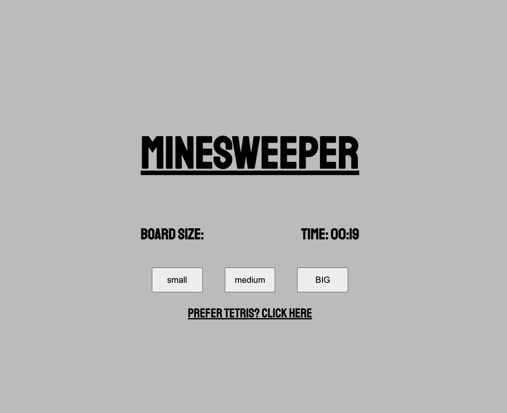
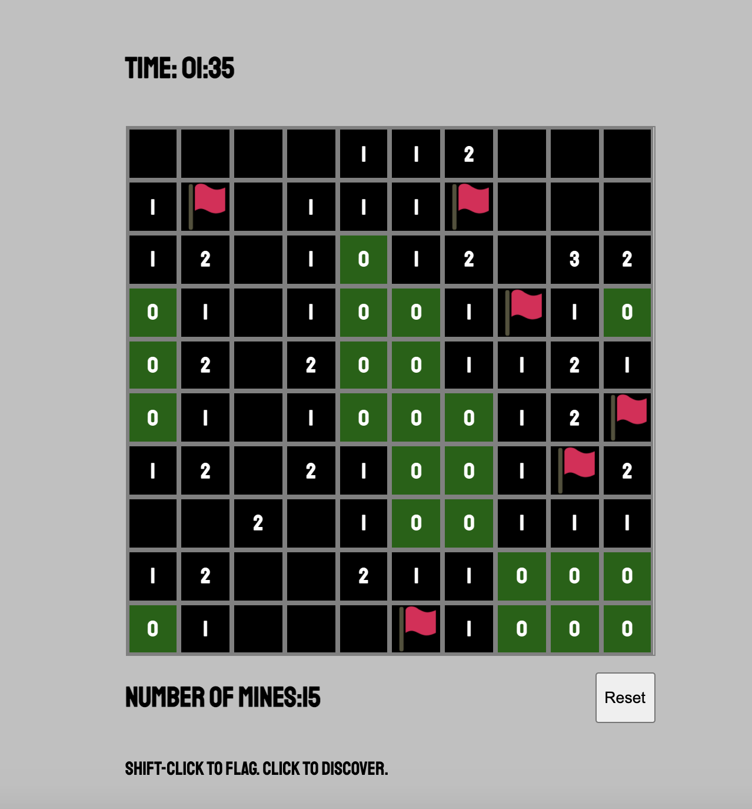
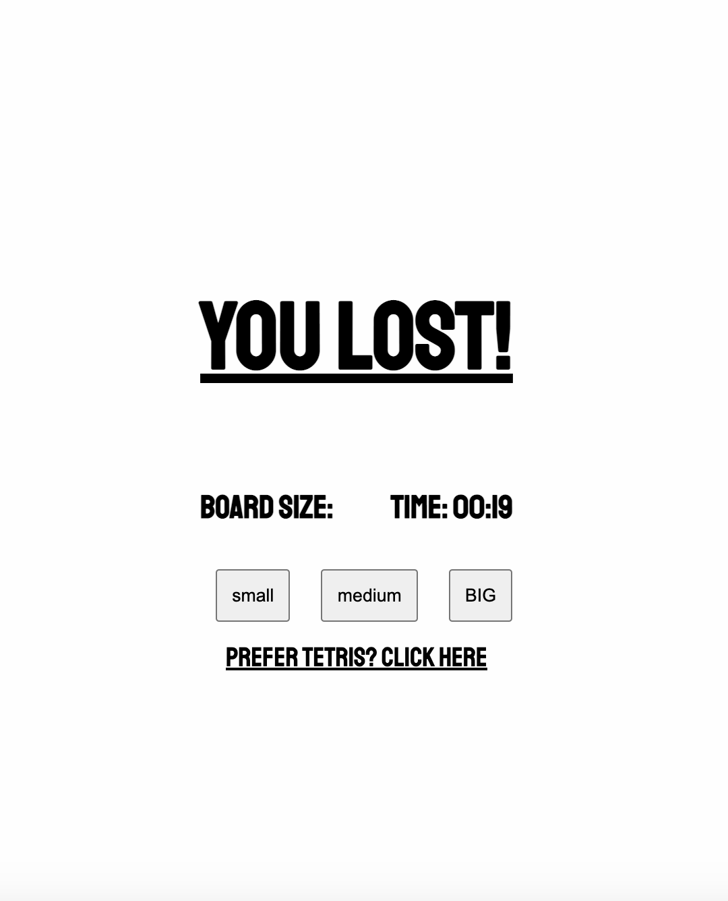

# Minesweeper

## Overview:

Minesweeper is one of my first front-end development projects created during and for the General Assembly Immersive Software Engineering Course.

The task was to individually create a game based on a grid of cells in one week. Minesweeper was developed after Tetris Funk in the remaining two days I had left.

Link: [Minesweeper](https://adwam12.github.io/project-1/Minesweeper/)

## Project requirements:
* Create a browser based grid game
* Use JavaScript for DOM manipulation
* Include separate HTML / CSS / JavaScript files
* Must include a win/lose condition

## Technologies Used:
* JavaScript (ES6)
* HTML5 & CSS3
* GitHub Pages
* Git


## Development:
### Setting the foundations
I decided to approach this project with a top down approach, starting with the most complicated part, and building down from there. Before creating a visual display, I created a grid of numbers with ones and zeroes represented in the console. Ones represented mines, zeroes represented empty cells.

### Basic functionality
I created a function to handle nested "For Loops" to run for each cell and count the amount of cells around it that contain a mine. This worked and assigned the amount of mines as a value inside of each cell.

This was the main logistical challenge dealt with. I then moved on to translating the grid of numbers to a visual grid containing cells with those numbers.

### Game Flow
On grid generation, assign a number of mines depending on the grid size/difficulty. Then cover all cells with a "hidden" class. Clicking on a particular cell removes the "hidden" class to reveal the number on the cell. If the number is zero, run through the grid and remove all zeroes. If the cell clicked on contains the class of "mine" end the game.


### Last touches
* Adding a timer to keep track of a high score
* Create different levels/difficulty
* Adding a Zen color scheme with animated background

## Future Features
* Adding various sound effects
* Adding music
* Adding a backend to create global leaderboards

## Challenges:
The biggest challenge was to find a way to run through every cell and check the surrounding cell's values.

##Code Snippet:
```
function findAround(target) {
    let counter = -1
    let mineCount = 0
    let safe = true
    for (let c = 0; c < pol.length; c++) {
      for (let i = 0; i < pol[c].length; i++) {
        counter += 1
        performanceTest += 1
        if (counter === target) {
          if (pol[c][i] === 1) {
            console.log('Thats a mine!')
            safe = false
          }
          //Checks cell above target
          if (pol[c - 1] && pol[c - 1][i]) {
            // console.log('Above: ', pol[c - 1][i])
            if (pol[c - 1][i] === 1) {
              mineCount += 1
            }
          }
          //Checks cell above to the right
          if (pol[c - 1] && pol[c - 1][i + 1]) {
            // console.log('Above-Right: ', pol[c - 1][i + 1])
            if (pol[c - 1][i + 1] === 1) {
              mineCount += 1
            }
          }
```
## Screenshots:



