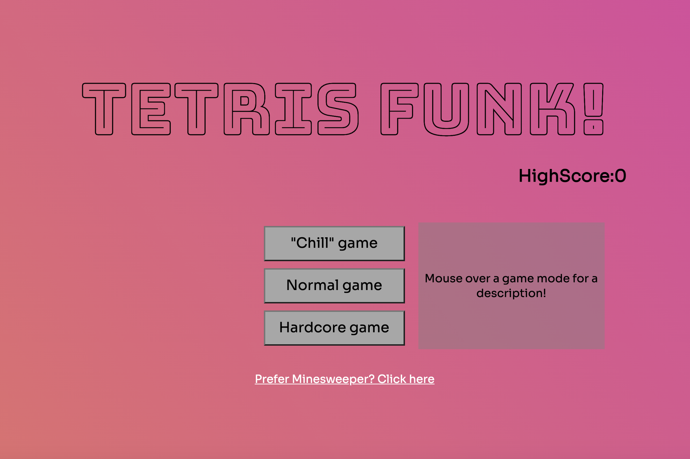
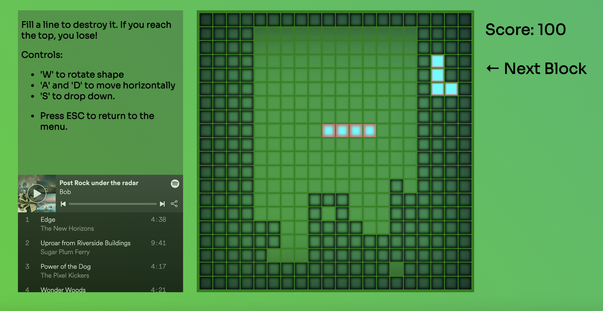

# Tetris Funk!

## Overview:

Tetris Funk is my first front-end development project created during and for the General Assembly Immersive Software Engineering Course.

The task was to individually create a game based on a grid of cells in one week.

Link: [Tetris Funk](https://adwam12.github.io/project-1/index.html)

## Project requirements:
* Create a browser based grid game
* Use JavaScript for DOM manipulation
* Must include a win/lose condition

## Technologies Used:
* JavaScript (ES6)
* HTML5 & CSS3
* GitHub Pages
* Git

## Development:
### Setting the foundations
I started the development by creating a working grid, that could have individual cells colored in by css. I wanted the grid to be modular so it could be easily changed if my project took an unexpected direction. The grid started as a 5x5 for testing purposes, meaning it consisted of 5 arrays, each containing 5 elements. For each element in the grid, I created an html "cell" who's behavior would be determined by class tags I could programatically add or remove. To move a single cell down, it would carry the "active" tag, meaning it was not an empty cell, then I would remove that active cell tag and add it to the cell below it, after calculating it's new position. 

### Basic functionality
Once I had movement working on a single cell, I had to create shapes (Tetromino). My concept for this was to designate one cell to be the "root" and all the other cells that make up the shape would be created by checking what shape was required, what position it was to be created in, and then adding the "active" tag around the root. This was stored in the "updateShape" function that was run everytime the root moved or the rotate button was pressed.

I now had any desired shape able to move and rotate by moving a single cell. 

### Collision detection
I had been working with an "activeShape" function to control the movement of the root cell, that function calculated the desired cell to move to by using nested "For Loops". I thought I could try and adapt this function to run through every cell that was a possible new position for the root cell and it's children. Any cell that had previously landed and solidified was given an "inactive" tag, so all I had to do to detect a possible collision was check if any cell that would be occupied next turn already carried the "inactive" tag and if it did, either prevent that movement (if it was a rotation) or solidify that shape and create a new one at the top of the grid. This worked perfectly and there was just one major task left to tackle.

### Emptying full rows
I thought this part of the project would be the trickiest, but proved to be easier to implement due to the existing functions. 
I adapted the "activeShape" once again so that right before solidifying, I ran a collision detection for all surrounding cells, if those contained a "inactive" tag, then re-run the collision detection from those. By keeping track of how many times the detection collision ran, I could tell if it had run the width of the entire grid. If it did, check what rows it completed in, and replace the "inactive" tag with the "destroy" tag, that had a css animation attached to it, which would flash them then remove any tags attached. Once this was done, I could simply run my "activeShape" function for every cell, which would bring every cell down by one.
This sequence was run simultanously for every completed row added 100 points to the score, ensuring a working and smooth grid transition.

### Last touches
Creating a win/lose condition was simple. As soon as a new shape was created, if already returned a positive collision, then game over.

I now had a fully working prototype and had a few things to improve before publishing it.

* Modify the grid to be 20x20 instead of 5x5
* Add different game modes with modifiers
* Implement a high score mechanic
* Improve the look of the game

I decided to give the game a "funk" aesthetic, and game modes to match. The "hardcore" gamemode was implemented by adding a css animation to the entire grid, the "normal" gamemode provided the standard tetris experience, and the "chill" gamemode removed the automatic time constraint and the highscore.

## Code Snippets:
#### Part 1 of the active shape function

Controls movement, this is run for every cell in the active shape:
```
if ((gridTest.indexOf(cell) === (shape.root + width)) || (gridTest.indexOf(cell) === (shape.pos1 + width)) || (gridTest.indexOf(cell) === (shape.pos2 + width)) || (gridTest.indexOf(cell) === (shape.pos3 + width))) {
      if ((cell.classList.contains('inactive')) && (cell.classList.contains('skip') === false)) {
        console.log('ACTIVE BELOW')
        gridTest.forEach((cell) => {
          if (Object.values(shape).includes(gridTest.indexOf(cell))) {
            if (cell.classList.contains('fakeInactive') === false) {
              cell.classList.add('inactive')
              loss = true
              console.log('SET INACTIVE')
              if (!(filledCells.includes(gridTest.indexOf(cell)))) {
                console.log('NOT USELESS')
                filledCells = filledCells.concat(Object.values(shape))
                console.log(filledCells)
                gridTest.forEach((cell) => {
                  if (Object.values(shape).includes(gridTest.indexOf(cell))) {
                    cell.classList.add('inactive')
                    changeShape = true
                  }
                })
              }
            }
          }
        })
      }
    }
```
#### Snippet of shape rotation model
For the Z shape moving from pointing down to pointing right:
```
  shapeZDownToRight = {
    root: root,
    pos1: root + width,
    pos2: root + 1,
    pos3: root + width - 1
  }
```
  
#### Snippet of a key input function
```
  if (key === 'w') {
  	if (canTurn(shapePos) === true) {
      if (shapePos === 'Ldown') {
        shapeLDownToRight.pos1 = root + 1
        shapeLDownToRight.pos2 = root + 2
        shapeLDownToRight.pos3 = root - width + 2
        shapePos = 'Lright'
        activeShape(shapeLDownToRight)
        return
      }
```
## Future Development
* Build a backend to be able to provide a global leaderboard
* The embeded Spotify only plays snippets unless the user has Spotify Premium
* Add various sound effects

## Challenges:

* Creating different blocks/Tetromino
* Making the Tetromino rotate around
* General Tetromino movement
* Emptying a full line and moving each Tetromino above down one
* Collision detection

By far the biggest challenge of this project was creating a working system for collision detection, both for filled blocks but also for the edges of the game board. A spot had to be empty for the Tetrino to rotate, move side to side and appear.


## Screenshots:


